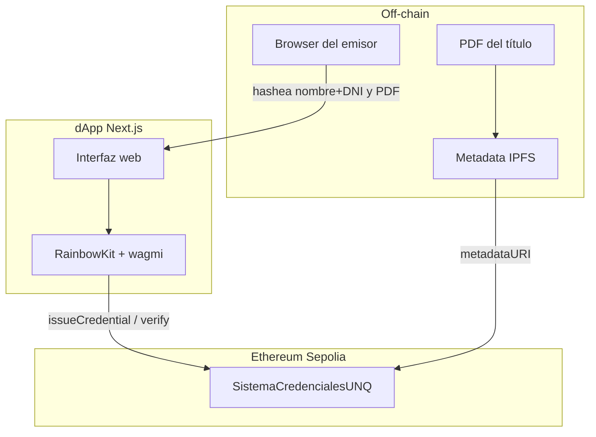

# Informe de Entrega — Sistema de Credenciales Académicas UNQ

**Materia:** Desarrollo de Contratos Inteligentes y dApps  
**Institución:** Diplomatura en Blockchain 2026 — Universidad Nacional de Quilmes  
**Proyecto:** `SistemaCredencialesUNQ` (contrato + dApp)  
**Fecha del informe:** 14 de junio de 2026  
**Repositorio:** [UVQ-VNT](https://github.com/vnoemitorres-arch/UVQ-VNT)

---

## 1. Resumen ejecutivo

Este trabajo final implementa un **sistema completo de credenciales académicas** sobre blockchain, compuesto por:

1. **Contrato inteligente** `SistemaCredencialesUNQ` — ERC-721 Soulbound con control de acceso por roles, emisión, verificación pública y revocación.
2. **Batería de tests automatizados** — 9 casos con **100% de cobertura** de líneas y statements (umbral del TP: ≥ 80%).
3. **Despliegue en Ethereum Sepolia** — contrato verificado en Blockscout y Sourcify.
4. **dApp web (Next.js)** — interfaz para emitir credenciales (rol emisor) y verificarlas públicamente (sin wallet).

El flujo end-to-end fue validado manualmente en testnet: se emitió una credencial real desde la web y se verificó consultando el `tokenId` on-chain.

---

## 2. Problema y objetivos

### 2.1. Contexto

El fraude documental con títulos académicos es un problema real. Una solución blockchain aporta:

| Propiedad | Beneficio |
|-----------|-----------|
| Inmutabilidad | El registro queda en la red y no puede alterarse sin consenso |
| Verificabilidad | Cualquier tercero puede consultar si una credencial es válida |
| Soberanía del egresado | El título se asocia a la wallet del alumno |
| Control institucional | La universidad puede revocar credenciales emitidas por error o fraude |

### 2.2. Objetivos cumplidos

- [x] Modelar roles institucionales (Rector/Admin y Emisor)
- [x] Emitir credenciales como NFT **Soulbound** (no transferibles)
- [x] Proteger datos personales mediante hashes (nombre + DNI off-chain)
- [x] Permitir verificación pública sin autenticación
- [x] Permitir revocación institucional
- [x] Alcanzar cobertura de tests ≥ 80%
- [x] Desplegar en testnet y exponer funcionalidad vía dApp

---

## 3. Arquitectura general del sistema



### 3.1. Repositorios del proyecto

| Carpeta | Rol |
|---------|-----|
| `diplo-unq-blockchain-tp-final/` | Contrato Solidity, tests Hardhat, scripts de deploy y verify |
| `diplo-unq-blockchain-tp-final-starter/` | Frontend Next.js 14 con wagmi y RainbowKit |

---

## 4. Contrato inteligente

### 4.1. Identificación

| Campo | Valor |
|-------|-------|
| **Nombre** | `SistemaCredencialesUNQ` |
| **Archivo** | `diplo-unq-blockchain-tp-final/contracts/SistemaCredencialesUNQ.sol` |
| **Licencia** | MIT |
| **Solidity** | `^0.8.24` (EVM Cancun) |
| **Estándares** | ERC-721 (`ERC721URIStorage`) + `AccessControl` (OpenZeppelin 5.6.1) |
| **Token** | Nombre: *Diplomatura UNQ* · Símbolo: `DUNQ` |

### 4.2. Modelo de datos — `Credential`

| Campo | Tipo | Descripción |
|-------|------|-------------|
| `degreeName` | `string` | Carrera o título |
| `studentNameHash` | `bytes32` | `keccak256(nombre ‖ DNI)` — privacidad por compromiso |
| `issueDate` | `uint256` | Timestamp de emisión |
| `documentHash` | `bytes32` | Huella del documento PDF |
| `active` | `bool` | Vigencia de la credencial |

### 4.3. Roles

| Rol | Constante | Responsabilidad |
|-----|-----------|-----------------|
| Rector / Admin | `DEFAULT_ADMIN_ROLE` | `grantIssuer`, `revokeIssuer` |
| Emisor | `ISSUER_ROLE` | `issueCredential`, `revoke` |

En el constructor, la dirección del Rector recibe ambos roles.

### 4.4. Funciones principales

| Función | Permiso | Descripción |
|---------|---------|-------------|
| `grantIssuer(address)` | Admin | Habilita un emisor |
| `revokeIssuer(address)` | Admin | Revoca rol de emisor |
| `issueCredential(...)` | Emisor | Mintea NFT Soulbound con datos |
| `revoke(tokenId, reason)` | Emisor | Marca credencial como inactiva |
| `verify(tokenId)` | Público (view) | Devuelve datos + `isValid` |

### 4.5. Soulbound

Se sobreescribe `_update` para impedir transferencias entre wallets:

```solidity
if (from != address(0) && to != address(0)) {
    revert("Soulbound: Las credenciales son intransferibles");
}
```

### 4.6. Eventos

- `CredentialIssued(student, tokenId, degreeName, studentNameHash)`
- `CredentialRevoked(tokenId, by, reason)`
- `IssuerGranted` / `IssuerRevoked`

---

## 5. Tests automatizados

**Archivo:** `diplo-unq-blockchain-tp-final/tests/SistemaCredencialesUNQ.t.sol`  
**Framework:** Hardhat 3 Solidity Tests + forge-std

### 5.1. Casos de prueba (9)

| # | Test | Categoría |
|---|------|-----------|
| 1 | `test_AdminAgregaIssuer` | Camino feliz |
| 2 | `test_AdminRevocaIssuer` | Camino feliz |
| 3 | `test_IssuerEmiteCredencial` | Camino feliz |
| 4 | `test_IssuerRevocaCredencial` | Camino feliz |
| 5 | `test_SupportsInterface` | Compatibilidad ERC-165 |
| 6 | `test_FallarEmisionSinRol` | Error de acceso |
| 7 | `test_FallarRevocacionCredencialInexistente` | Error |
| 8 | `test_FallarTransferenciaSoulbound` | Soulbound |
| 9 | `testFuzz_issueCredential` | Fuzz (256 runs) |

### 5.2. Cobertura

| Métrica | Resultado | Requisito TP |
|---------|-----------|--------------|
| Líneas | **100.00%** | ≥ 80% |
| Statements | **100.00%** | ≥ 80% |
| Tests pasados | **9 / 9** | — |

**Comando:**

```bash
cd diplo-unq-blockchain-tp-final
npx hardhat test solidity --coverage
```

Reporte HTML generado en: `coverage/html/index.html`

### 5.3. Datos de prueba del contrato

```solidity
bytes32 studentHash = keccak256(abi.encodePacked("Juan Perez", "12345678"));
bytes32 docHash     = keccak256(abi.encodePacked("PDF_TITULO"));
```

---

## 6. Despliegue en testnet

| Dato | Valor |
|------|-------|
| **Red** | Ethereum Sepolia |
| **Chain ID** | `11155111` |
| **Contrato** | `0x3C24c2d15FbC06228acfe450F35E659A26821292` |
| **Rector (deployer)** | `0x392aA6EC06fABDb4001cC627f3c5ecbAcCd423Ff` |
| **Script** | `diplo-unq-blockchain-tp-final/scripts/deploy.js` |

### 6.1. Verificación del código fuente

| Explorador | Estado | Enlace |
|------------|--------|--------|
| Blockscout | ✅ Verificado | [Ver contrato](https://eth-sepolia.blockscout.com/address/0x3C24c2d15FbC06228acfe450F35E659A26821292#code) |
| Sourcify | ✅ Verificado | [Ver contrato](https://sourcify.dev/server/repo-ui/11155111/0x3C24c2d15FbC06228acfe450F35E659A26821292) |
| Etherscan | Pendiente API key | [Ver contrato](https://sepolia.etherscan.io/address/0x3C24c2d15FbC06228acfe450F35E659A26821292) |

---

## 7. dApp web (frontend)

### 7.1. Stack tecnológico

| Componente | Versión |
|------------|---------|
| Next.js | 14.0.0 |
| React | 18.x |
| TypeScript | 5.x |
| wagmi | 2.x |
| viem | 2.52.2 |
| RainbowKit | 2.x |
| TanStack Query | 5.x |

### 7.2. Estructura de la aplicación

```
diplo-unq-blockchain-tp-final-starter/
├── app/
│   ├── layout.tsx              # Layout global
│   ├── page.tsx                # Página principal
│   ├── providers.tsx           # Wagmi + RainbowKit + React Query
│   └── components/
│       ├── IssueCredentialForm.tsx   # Emisión (solo ISSUER_ROLE)
│       └── Verifier.tsx              # Verificación pública
├── contracts/
│   └── credentials.ts          # ABI + address del contrato en Sepolia
├── wagmi.ts                    # Configuración de red y WalletConnect
├── .env.local                  # NEXT_PUBLIC_WALLETCONNECT_PROJECT_ID
└── captura_emision_credencial.png
```

### 7.3. Funcionalidades implementadas

#### Verificador público (`Verifier.tsx`)

- **No requiere wallet** conectada.
- El usuario ingresa un `tokenId` y la app llama `verify(tokenId)` on-chain.
- Muestra: validez, título, fecha, hashes y estado (Activa / Revocada).

#### Emisor (`IssueCredentialForm.tsx`)

- Visible solo si la wallet conectada tiene `ISSUER_ROLE`.
- Hashea en el **browser** (viem):
  - `studentNameHash = keccak256(encodePacked(nombre, dni))`
  - `documentHash = keccak256(encodePacked(identificadorPDF))`
- Envía transacción `issueCredential` vía MetaMask.
- Muestra enlace a Etherscan al confirmar.

#### Control de acceso en UI (`page.tsx`)

- `ConnectButton` de RainbowKit para conectar wallet.
- Consulta `hasRole(ISSUER_ROLE, address)` para mostrar u ocultar el formulario de emisión.

### 7.4. Configuración requerida

**Archivo:** `diplo-unq-blockchain-tp-final-starter/.env.local`

```env
NEXT_PUBLIC_WALLETCONNECT_PROJECT_ID=<Project ID de Reown Cloud>
```

El Project ID se obtiene gratis en [cloud.reown.com](https://cloud.reown.com) (antes WalletConnect Cloud). Es un identificador público necesario para que RainbowKit conecte wallets vía WalletConnect.

### 7.5. Cómo ejecutar la dApp

```bash
cd diplo-unq-blockchain-tp-final-starter
npm install
npm run dev
# Abrir http://localhost:3000
```

Requisitos: MetaMask configurado en **Ethereum Sepolia** con ETH de prueba.

---

## 8. Prueba manual en testnet (validación end-to-end)

Se ejecutó una emisión real desde la dApp y se verificó el resultado on-chain.

### 8.1. Datos ingresados en el formulario de emisión

| Campo | Valor utilizado |
|-------|-----------------|
| Address del estudiante | `0x392aA6EC06fABDb4001cC627f3c5ecbAcCd423Ff` |
| Título | `Licenciatura en Sistemas de Información` |
| Nombre completo | `Juan Perez` |
| DNI | `12345678` |
| Identificador del PDF | `PDF_TITULO` |
| Metadata URI (IPFS) | `ipfs://QmTestCredencialUNQ001` |

> **Privacidad:** el nombre y el DNI **no se almacenan en claro** en la blockchain; solo sus hashes.

### 8.2. Transacción de emisión

| Dato | Valor |
|------|-------|
| **Tx hash** | `0xdaee56d2bfc9d9e4c6614522bf0596c380bfecbc399ae341e554b3ddf6524c33` |
| **Etherscan** | [Ver transacción](https://sepolia.etherscan.io/tx/0xdaee56d2bfc9d9e4c6614522bf0596c380bfecbc399ae341e554b3ddf6524c33) |
| **Evento emitido** | `CredentialIssued` |
| **tokenId asignado** | `0` |
| **Estudiante (owner)** | `0x392aA6EC06fABDb4001cC627f3c5ecbAcCd423Ff` |

### 8.3. Verificación con `tokenId = 0`

Al consultar `verify(0)` en Sepolia:

| Campo | Valor on-chain |
|-------|----------------|
| `degreeName` | Licenciatura en Sistemas de Información |
| `studentNameHash` | `0x6c3a94eb9579f12142d61bd1da5375232b1d1a88de98544663d25b1f44ff4b91` |
| `documentHash` | `0x36d7f7f167cf41ed79aaa6f8717ece2afbb18cb4f30b74c3bec4f134c68903ac` |
| `active` | `true` |
| `isValid` | `true` |

**En la web:** ingresar `0` en el campo *Token ID* de la sección *Verificar credencial* → resultado esperado: **✅ Credencial válida**.

### 8.4. Evidencia visual

Captura de pantalla de la emisión exitosa:

`diplo-unq-blockchain-tp-final-starter/captura_emision_credencial.png`

La captura muestra:
- Wallet conectada en Sepolia (5.03 ETH)
- Formulario de emisión completado
- Mensaje **"✅ Credencial emitida"** con enlace a la transacción

---

## 9. Consideraciones de seguridad

Extraído de `diplo-unq-blockchain-tp-final/Security.MD`:

| Riesgo | Mitigación propuesta |
|--------|---------------------|
| Pérdida de wallet del Rector | Multisig (Gnosis Safe) para `DEFAULT_ADMIN_ROLE` |
| Compromiso de emisor | `revokeIssuer` + `revoke()` sobre credenciales fraudulentas |
| Ataque de diccionario sobre hash del nombre | Incorporar salt/pepper al hash |
| Error en emisión | Revocar credencial incorrecta y emitir una nueva |

**Buenas prácticas aplicadas en el proyecto:**

- Claves privadas solo en `.env` local (nunca en Git)
- Datos personales hasheados en el cliente antes de enviar a la red
- Control de acceso con OpenZeppelin `AccessControl`
- Tokens Soulbound para evitar mercado secundario de títulos

---

## 10. Stack y comandos de referencia

### Contrato (`diplo-unq-blockchain-tp-final`)

```bash
npm install
npx hardhat compile
npm test
npx hardhat test solidity --coverage
node scripts/deploy.js
```

| Herramienta | Versión |
|-------------|---------|
| Hardhat | 3.9.0 |
| ethers.js | 6.16.0 |
| OpenZeppelin | 5.6.1 |
| forge-std | 1.9.4 |

### dApp (`diplo-unq-blockchain-tp-final-starter`)

```bash
npm install
npm run dev      # desarrollo
npm run build    # producción
npm start        # servir build
```

---

## 11. Checklist de entregables

| Entregable | Estado |
|------------|--------|
| Contrato `SistemaCredencialesUNQ.sol` | ✅ |
| Tests con cobertura ≥ 80% | ✅ (100%) |
| Deploy en testnet (Sepolia) | ✅ |
| Código verificado en explorador | ✅ (Blockscout + Sourcify) |
| dApp con emisión y verificación | ✅ |
| Conexión wallet (RainbowKit / WalletConnect) | ✅ |
| Prueba manual end-to-end en Sepolia | ✅ |
| Captura de evidencia | ✅ |
| Documentación técnica | ✅ (este informe + `INFORME.md`) |
| Análisis de seguridad | ✅ (`Security.MD`) |

---

## 12. Conclusiones

1. Se implementó un sistema **completo** de credenciales académicas: contrato, tests, deploy y dApp.
2. El contrato cumple el modelo del TP: roles, emisión NFT, verificación pública, revocación y restricción Soulbound.
3. La **privacidad** se resguarda hasheando nombre+DNI y documento en el navegador antes de registrar on-chain.
4. Los **9 tests automatizados** alcanzan **100% de cobertura**, superando el umbral del 80%.
5. El contrato está **desplegado y verificado** en Ethereum Sepolia.
6. La **dApp** permite a un emisor mintear credenciales y a cualquier persona verificarlas con solo el `tokenId`.
7. El flujo fue **validado en producción de testnet** con la transacción `0xdaee56d2…` y verificación del `tokenId 0`.

---

## 13. Referencias

- [OpenZeppelin — AccessControl](https://docs.openzeppelin.com/contracts/5.x/access-control)
- [OpenZeppelin — ERC721](https://docs.openzeppelin.com/contracts/5.x/erc721)
- [Hardhat 3 — Solidity Tests](https://hardhat.org/docs/learn-more/solidity-tests)
- [wagmi](https://wagmi.sh/)
- [RainbowKit](https://www.rainbowkit.com/)
- [Reown Cloud (WalletConnect)](https://cloud.reown.com)
- [Ethereum Sepolia](https://sepolia.etherscan.io/)

---

## Anexo A — Informe técnico del contrato

Documento complementario con mayor detalle sobre tests y cobertura:

`diplo-unq-blockchain-tp-final/INFORME.md`

---

*Documento generado para entrega académica — Diplomatura en Blockchain UNQ 2026.*
