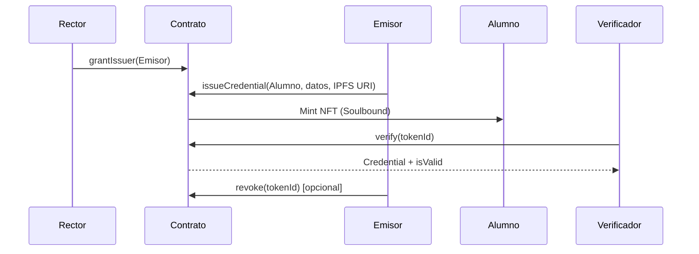

# Informe Técnico — Sistema de Verificación de Credenciales Académicas (UNQ)

**Materia:** Desarrollo de Contratos Inteligentes y dApps  
**Institución:** Diplomatura en Blockchain 2026 — Universidad Nacional de Quilmes  
**Proyecto:** `SistemaCredencialesUNQ`  
**Fecha del informe:** 15 de junio de 2026  

---

## 1. Resumen ejecutivo

Este trabajo implementa un sistema de credenciales académicas sobre blockchain que permite a la UNQ emitir títulos digitales inmutables, verificables públicamente y protegidos por un esquema de privacidad basado en hashes. Cada credencial se representa como un token **ERC-721** con metadatos en **IPFS**, restringido por diseño como **Soulbound** (no transferible).

El contrato fue desplegado en **Ethereum Sepolia** (testnet) y validado mediante una batería de **9 tests automatizados** con **100% de cobertura de líneas y statements**, ejecutados localmente con **Hardhat 3** y **forge-std**.

---

## 2. Problema y objetivo

### Contexto

El fraude documental con títulos académicos es un problema real en Argentina. Una solución basada en blockchain aporta:

- **Inmutabilidad:** el estado queda registrado en la red.
- **Verificabilidad:** cualquier tercero puede consultar on-chain si una credencial es válida.
- **Soberanía del egresado:** el título se asocia a la wallet del alumno.
- **Control institucional:** la universidad puede revocar credenciales emitidas por error o fraude.

### Objetivo del contrato

Centralizar el ciclo de vida de una credencial universitaria: alta de emisores, emisión, verificación pública y revocación, con restricción de transferencia.

---

## 3. Detalle del contrato inteligente

| Campo | Valor |
|-------|-------|
| **Nombre del contrato** | `SistemaCredencialesUNQ` |
| **Archivo fuente** | `contracts/SistemaCredencialesUNQ.sol` |
| **Licencia** | MIT |
| **Compilador** | Solidity `^0.8.24` |
| **EVM target** | Cancun |
| **Estándar base** | ERC-721 (`ERC721URIStorage`) + `AccessControl` (OpenZeppelin v5.6.1) |
| **Nombre del token** | Diplomatura UNQ |
| **Símbolo** | DUNQ |

### 3.1. Modelo de datos — struct `Credential`

| Campo | Tipo | Descripción |
|-------|------|-------------|
| `degreeName` | `string` | Nombre de la carrera o título |
| `studentNameHash` | `bytes32` | Hash `keccak256(nombre + DNI)` — esquema de compromiso para privacidad |
| `issueDate` | `uint256` | Timestamp de emisión (blockchain) |
| `documentHash` | `bytes32` | Huella del PDF original off-chain |
| `active` | `bool` | Indica si la credencial está vigente |

### 3.2. Roles de acceso

| Rol | Identificador | Responsabilidad |
|-----|---------------|-----------------|
| **Rector / Admin** | `DEFAULT_ADMIN_ROLE` | Otorga y revoca emisores (`grantIssuer`, `revokeIssuer`) |
| **Emisor** | `ISSUER_ROLE` | Emite y revoca credenciales |

En el constructor, la dirección del **Rector** recibe ambos roles.

### 3.3. Funciones principales

| Función | Permiso | Descripción |
|---------|---------|-------------|
| `grantIssuer(address)` | Admin | Habilita a un decano u otro emisor |
| `revokeIssuer(address)` | Admin | Quita el rol de emisor |
| `issueCredential(...)` | Emisor | Crea un NFT soulbound con datos de la credencial |
| `revoke(tokenId, reason)` | Emisor | Marca la credencial como inactiva |
| `verify(tokenId)` | Público (view) | Devuelve datos y validez actual |

### 3.4. Eventos emitidos

- `CredentialIssued` — nueva credencial emitida  
- `CredentialRevoked` — credencial revocada  
- `IssuerGranted` / `IssuerRevoked` — cambios en emisores autorizados  

### 3.5. Mecanismo Soulbound

Se sobreescribe `_update` para impedir transferencias entre wallets una vez minteado el token:

```solidity
if (from != address(0) && to != address(0)) {
    revert("Soulbound: Las credenciales son intransferibles");
}
```

Solo se permiten operaciones de mint (`from == 0`) y burn (`to == 0`).

### 3.6. Diagrama de flujo simplificado



---

## 4. Despliegue en testnet

| Dato | Valor |
|------|-------|
| **Red** | Ethereum Sepolia |
| **Chain ID** | `11155111` |
| **Dirección del contrato** | `0x3C24c2d15FbC06228acfe450F35E659A26821292` |
| **Dirección del Rector (deployer)** | `0x392aA6EC06fABDb4001cC627f3c5ecbAcCd423Ff` |
| **Herramienta de deploy** | `scripts/deploy.js` (Hardhat + ethers v6) |

### Enlaces de verificación del código fuente

| Explorador | Estado | URL |
|------------|--------|-----|
| **Blockscout (Sepolia)** | Verificado | [Ver contrato](https://eth-sepolia.blockscout.com/address/0x3C24c2d15FbC06228acfe450F35E659A26821292#code) |
| **Sourcify** | Verificado | [Ver contrato](https://sourcify.dev/server/repo-ui/11155111/0x3C24c2d15FbC06228acfe450F35E659A26821292) |
| **Etherscan (Sepolia)** | Pendiente de API key | [Ver contrato](https://sepolia.etherscan.io/address/0x3C24c2d15FbC06228acfe450F35E659A26821292) |

---

## 5. Entorno de desarrollo y testing

| Componente | Versión / herramienta |
|------------|----------------------|
| **Hardhat** | 3.9.0 |
| **ethers.js** | 6.16.0 |
| **OpenZeppelin Contracts** | 5.6.1 |
| **forge-std** | 1.9.4 |
| **Framework de tests** | Hardhat Solidity Tests (compatible Foundry) |

### Comandos utilizados

```bash
# Compilar
npx hardhat compile

# Ejecutar tests
npm test
# equivalente a: npx hardhat test solidity

# Medir cobertura de código
npx hardhat test solidity --coverage
# reporte HTML en: coverage/html/

# Desplegar en Sepolia
node scripts/deploy.js
```

---

## 6. Batería de tests

**Archivo:** `tests/SistemaCredencialesUNQ.t.sol`  
**Contrato de test:** `SistemaCredencialesUNQTest`  

Cada test corre con un estado limpio gracias a `setUp()`, que despliega un contrato nuevo y define cuentas simuladas (`decano`, `alumno`).

### 6.1. Casos de prueba

| # | Test | Categoría | Descripción | Resultado esperado |
|---|------|-----------|-------------|-------------------|
| 1 | `test_AdminAgregaIssuer` | Camino feliz | El admin otorga rol de emisor al decano | `hasRole(ISSUER_ROLE, decano) == true` |
| 2 | `test_AdminRevocaIssuer` | Camino feliz | El admin revoca rol de emisor al decano | `hasRole(ISSUER_ROLE, decano) == false` |
| 3 | `test_IssuerEmiteCredencial` | Camino feliz | Emisión de credencial y consulta `verify` | `isValid == true`, carrera correcta |
| 4 | `test_IssuerRevocaCredencial` | Camino feliz | Revocación de credencial emitida | `isValid == false` tras revocar |
| 5 | `test_SupportsInterface` | Compatibilidad | Interfaces ERC-165, ERC-721 y AccessControl | `supportsInterface` devuelve `true` |
| 6 | `test_FallarEmisionSinRol` | Caso de error | Emisión sin `ISSUER_ROLE` | La transacción revierte |
| 7 | `test_FallarRevocacionCredencialInexistente` | Caso de error | Revocar un `tokenId` inexistente | Revert `"Credencial inexistente"` |
| 8 | `test_FallarTransferenciaSoulbound` | Caso de error | Intento de `transferFrom` del alumno al decano | Revert con mensaje Soulbound |
| 9 | `testFuzz_issueCredential` | Fuzz testing | 256 direcciones aleatorias de estudiantes | `ownerOf(tokenId) == estudiante` |

### 6.2. Datos de prueba comunes

```solidity
bytes32 studentHash = keccak256(abi.encodePacked("Juan Perez", "12345678"));
bytes32 docHash     = keccak256(abi.encodePacked("PDF_TITULO"));
```

### 6.3. Cobertura funcional

Los tests cubren los requisitos definidos en el enunciado del TP:

- ✅ Admin agrega emisor → emisor emite → verify devuelve datos correctos  
- ✅ Admin revoca emisor (`revokeIssuer`)  
- ✅ Address sin rol intenta emitir (revierte)  
- ✅ Revocación de credencial inexistente (revierte)  
- ✅ Transferencia Soulbound bloqueada  
- ✅ Compatibilidad de interfaces (`supportsInterface`)  
- ✅ Fuzzing de emisión con asignación correcta de `ownerOf(tokenId)`  
- ✅ Revocación institucional  

### 6.4. Cobertura de código (Hardhat `--coverage`)

**Comando:** `npx hardhat test solidity --coverage`  
**Requisito del TP:** Coverage ≥ 80%  
**Reporte HTML:** `coverage/html/index.html`

| Archivo | Líneas | Statements | Líneas sin cubrir |
|---------|--------|------------|-------------------|
| `contracts/SistemaCredencialesUNQ.sol` | **100.00%** | **100.00%** | — |
| **Total** | **100.00%** | **100.00%** | — |

**Evolución de la cobertura:**

| Iteración | Tests | Líneas | Statements | Acción |
|-----------|-------|--------|------------|--------|
| Inicial | 6 | 90.63% | 87.50% | Casos base del enunciado |
| Final | 9 | **100.00%** | **100.00%** | Se agregaron tests para `revokeIssuer`, `supportsInterface` y revocación de credencial inexistente |

Estado: ✅ **supera el umbral del 80%** exigido por la materia.

---

## 7. Resultado de la ejecución de tests

**Fecha de ejecución:** 15 de junio de 2026  
**Comando:** `npx hardhat test solidity --coverage`  
**Entorno:** local (Hardhat EDR / red simulada)  

### Salida completa de consola

Salida literal obtenida al ejecutar `npx hardhat test solidity --coverage` en el entorno local del proyecto:

```
No contracts to compile

Running Solidity tests

  tests/SistemaCredencialesUNQ.t.sol:SistemaCredencialesUNQTest
    ✔ test_SupportsInterface()
    ✔ test_IssuerRevocaCredencial()
    ✔ test_IssuerEmiteCredencial()
    ✔ test_FallarTransferenciaSoulbound()
    ✔ test_FallarRevocacionCredencialInexistente()
    ✔ test_FallarEmisionSinRol()
    ✔ test_AdminRevocaIssuer()
    ✔ test_AdminAgregaIssuer()
    ✔ testFuzz_issueCredential(address) (runs: 256)


  9 passing
Saved html report to coverage/html
╔═══════════════════════════════════════════════════════════════════════════════╗
║                                Coverage Report                                ║
╚═══════════════════════════════════════════════════════════════════════════════╝
╔═══════════════════════════════════════════════════════════════════════════════╗
║ File Coverage                                                                 ║
╟──────────────────────────────────────┬────────┬─────────────┬─────────────────╢
║ File Path                            │ Line % │ Statement % │ Uncovered Lines ║
╟──────────────────────────────────────┼────────┼─────────────┼─────────────────╢
║ contracts\SistemaCredencialesUNQ.sol │ 100.00 │ 100.00      │ -               ║
╟──────────────────────────────────────┼────────┼─────────────┼─────────────────╢
║ Total                                │ 100.00 │ 100.00      │                 ║
╚══════════════════════════════════════╧════════╧═════════════╧═════════════════╝
```

**Reporte HTML de cobertura:** `coverage/html/index.html`

### Resumen

| Métrica | Valor |
|---------|-------|
| **Tests ejecutados** | 9 |
| **Tests exitosos** | 9 |
| **Tests fallidos** | 0 |
| **Runs de fuzz** | 256 por caso |
| **Cobertura de líneas** | **100.00%** |
| **Cobertura de statements** | **100.00%** |
| **Umbral requerido (TP)** | ≥ 80% |
| **Estado final** | ✅ **TODOS PASARON — COBERTURA COMPLETA** |

---

## 8. Consideraciones de seguridad

Extraído del análisis documentado en `Security.MD`:

| Riesgo | Mitigación propuesta |
|--------|---------------------|
| Pérdida de wallet del Rector | Usar multisig (Gnosis Safe) para `DEFAULT_ADMIN_ROLE` |
| Compromiso de wallet de emisor | Revocar rol + `revoke()` sobre credenciales fraudulentas |
| Ataque de diccionario sobre `studentNameHash` | Incorporar salt/pepper al hash del nombre + DNI |
| Error en emisión | Revocar credencial incorrecta (`active: false`) y emitir una nueva |

El contrato aplica **Checks-Effects-Interactions** en la revocación y utiliza modificadores de OpenZeppelin (`onlyRole`) para control de acceso.

---

## 9. Estructura del repositorio

```
diplo-unq-blockchain-tp-final/
├── contracts/
│   └── SistemaCredencialesUNQ.sol    # Contrato principal
├── tests/
│   └── SistemaCredencialesUNQ.t.sol  # Tests Hardhat / forge-std
├── scripts/
│   ├── deploy.js                     # Deploy en Sepolia
│   └── verify.js                     # Verificación en exploradores
├── hardhat.config.js
├── package.json
├── README.md
├── Security.MD
└── INFORME.md                        # Este documento
```

---

## 10. Conclusiones

1. El contrato `SistemaCredencialesUNQ` cumple con el modelo funcional del TP: roles institucionales, emisión de credenciales como NFT, verificación pública y revocación.
2. La naturaleza **Soulbound** garantiza que los títulos no puedan transferirse entre wallets, reforzando la vinculación alumno–credencial.
3. El esquema de **privacidad por hash** evita exponer nombre y DNI en texto plano en la blockchain.
4. La batería de **9 tests automatizados** alcanza **100% de cobertura** de líneas y statements, superando ampliamente el umbral del **80%** exigido en el TP.
5. El contrato está **desplegado y verificado** en Ethereum Sepolia (Blockscout y Sourcify).

---

## 11. Referencias

- [OpenZeppelin Contracts — AccessControl](https://docs.openzeppelin.com/contracts/5.x/access-control)
- [OpenZeppelin Contracts — ERC721](https://docs.openzeppelin.com/contracts/5.x/erc721)
- [Hardhat 3 — Solidity Tests](https://hardhat.org/docs/learn-more/solidity-tests)
- [Ethereum Sepolia Testnet](https://sepolia.etherscan.io/)
- Repositorio del proyecto: [UVQ-VNT](https://github.com/vnoemitorres-arch/UVQ-VNT)

---

*Documento generado para entrega académica — Diplomatura en Blockchain UNQ 2026.*
