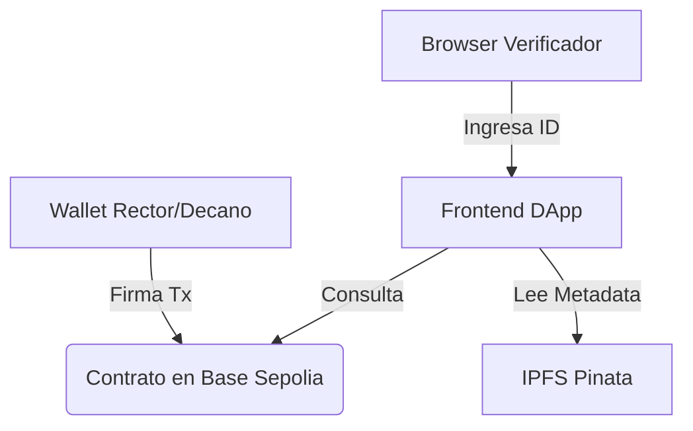
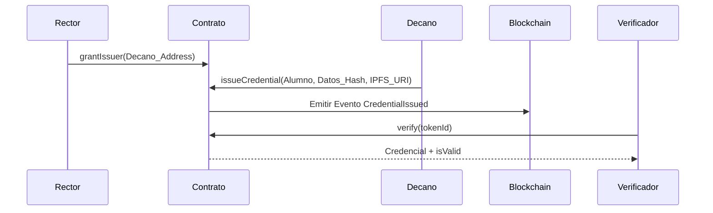

# TP - Sistema de Verificación de Credenciales Académicas (UNQ)

Este repositorio contiene el Trabajo Final para Desarrollo de Contratos Inteligentes y dApps de la Diplomatura en Blockchain 2026 (UNQ). El sistema permite la emisión de títulos universitarios inmutables, verificables y protegidos por privacidad utilizando la red Base Sepolia.

## 0. Hook UNQ: El Problema de la Confianza

### Contexto Institucional
En Argentina, el fraude con títulos académicos es una problemática real; en 2023 la "Operación Alejo" desbarató una red de 500 títulos falsos utilizados para ejercer medicina y educación. La **Universidad Nacional de Quilmes**, con más de 11.000 estudiantes activos, requiere un sistema que permita a cualquier entidad de RRHH del mundo verificar un título en 3 segundos sin depender de trámites centralizados que hoy demoran hasta 30 días.

### ¿Por qué Blockchain?
A diferencia de una base de datos tradicional que puede ser hackeada o alterada internamente, la blockchain ofrece:
*   **Inmutabilidad:** El estado vive replicado en miles de nodos.
*   **Soberanía:** El egresado posee su título en su wallet y nadie se lo puede quitar, salvo revocación administrativa.
*   **Transparencia:** El emisor (UNQ) firma criptográficamente y cualquiera verifica on-chain.

## 1. Arquitectura y Modelado de Datos (Parte 0.2)

### Diagrama de Componentes
El sistema integra los siguientes componentes en una arquitectura Web3:

### Modelado del Struct `Credential`
La información se organiza siguiendo un esquema de privacidad y eficiencia:
*   **degreeName:** Nombre de la carrera (texto plano).
*   **studentNameHash:** `keccak256(Nombre + DNI)`. **Commitment scheme** para proteger la identidad del graduado en un ledger público.
*   **issueDate:** Timestamp de emisión generado por la red.
*   **documentHash:** Huella digital (`bytes32`) del PDF original para garantizar su integridad off-chain.
*   **active:** Control de revocación institucional.

### Flujo de Emisión y Verificación

## 2. Desarrollo y Testing en REMIX IDE

Debido a que el desarrollo se realizó en el entorno **Remix IDE Web**, el flujo de trabajo se detalla a continuación:

### Compilación y Despliegue
*   **Compilador:** Solidity `0.8.34`.
*   **Entorno:** Injected Provider (MetaMask) conectado a **Base Sepolia** (Chain ID: 84532).
*   **Verificación:** Realizada mediante el plugin de Remix para Basescan utilizando la API Key `TZ5N64JS...`.

### Testing y Cobertura (Parte 2)
Para cumplir con el **Coverage ≥ 80%**, se utilizó el plugin **"Solidity Unit Testing"** de Remix con los siguientes casos:
1.  **Camino Feliz:** Admin agrega emisor → Emisor emite → Verify devuelve datos correctos.
2.  **Casos de Error:** Address sin rol intenta emitir (revierte); Intento de transferencia de título Soulbound (revierten).
3.  **Fuzzing:** Pruebas aleatorias de emisión para verificar la asignación correcta de `ownerOf(tokenId)`.

## 3. Seguridad (Parte 3)

El análisis de seguridad se encuentra documentado en el archivo `SECURITY.md` del repositorio. Se incluyen validaciones contra ataques de reentrada (**Checks-Effects-Interactions**) y el análisis de riesgos ante la pérdida de claves privadas de los roles `DEFAULT_ADMIN_ROLE` y `ISSUER_ROLE`.

## 4. Recursos y Entregables

*   **Código Fuente:** [vnoemitorres-arch/UVQ-VNT](https://github.com/vnoemitorres-arch/UVQ-VNT).
*   **Contrato Verificado:** `0x...` (Basescan Sepolia).
*   **Demo End-to-End:** Video de 3-5 minutos mostrando el flujo desde el Rector habilitando al emisor hasta la verificación fallida tras una transferencia (Soulbound).
